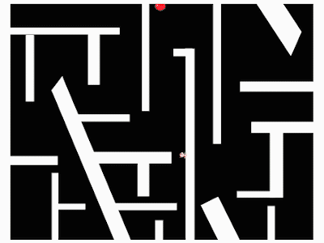

# raycast-3d-renderer
A basic 3d renderer implemented in Scratch (using raycasts)
~ Clone, Open the .sb3 file in [Scratch](https://scratch.mit.edu/), input any 2d map, it will get converted into a 3D world 

